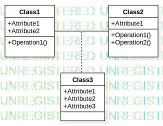
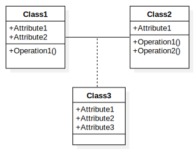

# StarUML watermark remover

Simple python program able to remove the "UNREGISTERED" StarUML watermark from <code>svg</code> files\
Output format:  <code>svg</code> or  <code>pdf</code> 

<table align = "center" style="border=none!important;">
  <tr>
    <td>  </td>
    <td> ➜ </td>
    <td>   </td>
  </tr>
</table>

## Installation
Clone this repository
```bash
git clone https://github.com/MattiaCazzolla/starUML-watermark-remover.git
```
or download the <code>main.py</code> file

## Requirements (only for pdf)
To generate the <code>pdf</code> version is necessary to install the <code>svglib</code> package\
If the <code>--pdf</code> option will not be used then is not necessary

```bash
pip install svglib
```
or
```bash
pip install -r requirements.txt
```

##  Usage
Export the StarUML diagrams as SVG files in a directory

To remove the watermarks from all <code>svg</code> files 
```bash
python main.py /path/to/directory
```
To generate also a <code>pdf</code> version of the files
```bash
python main.py /path/to/directory --pdf
```
## License
This project is licensed under the [MIT](LICENSE) License.
